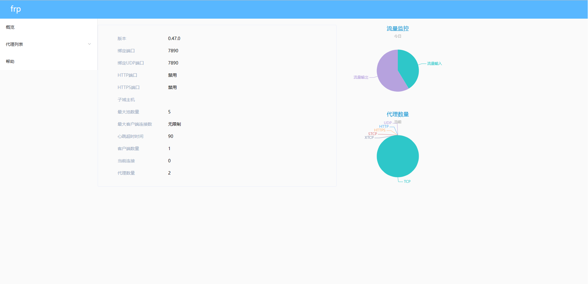

# Frps仪表台简体中文版

> 由于gofrp项目官方的仪表盘是英文版的，特此我特地汉化了仪表盘，方便英语不好的人访问仪表盘

项目是基于[@fatedier](https://github.com/fatedier)的[https://github.com/fatedier/frp](https://github.com/fatedier/frp)项目二次修改

## 预览



# 安装方法
### 1. 下载frp项目源码[https://github.com/fatedier/frp/releases](https://github.com/fatedier/frp/releases)
### 2. 删除源码中的`./web/frps`文件夹
```shell
rm -rf ./web/frps/
```
### 3. 克隆当前仓库代码到`./web/frps`
```shell
git clone https://github.com/wenisok/frps-chinese-dashboard /path/to/frp-0.xx.x/web/frps
```
### 3. 编译仪表台源码，需`node.js`环境
```shell
cd web/frps
yarn #or npm install
yarn build #or npm build
```
### 4. 编译frps
```shell
cd /path/to/frp-0.xx.x
make file
make frps
```
### 5. 大功告成
编译后的文件位于`/path/to/frp-0.xx.x/bin/frps`